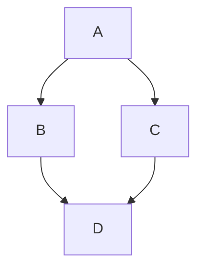

---
component:
  name: markdown_comprehensive
  category: tools
  version: 1.0.0
  tier: comprehensive
  description: Comprehensive Markdown reference with advanced formatting and best practices
  languages: [rust, python, golang, typescript, bash]
  sections:
    - id: file_naming
      language_specific: false
      required: true
    - id: document_structure
      language_specific: false
      required: true
    - id: code_blocks
      language_specific: true
      required: true
    - id: advanced_formatting
      language_specific: false
      required: true
    - id: troubleshooting
      language_specific: false
      required: true
---

# Markdown Comprehensive Guidelines

Complete Markdown reference including advanced formatting, best practices, and troubleshooting.

---

## File Naming Convention

**MANDATORY RULES:**

- Use lowercase letters ONLY
- Use underscores to separate words
- Use `.md` extension (NOT `.MD` or `.markdown`)
- **Exception**: `README.md` is the ONLY uppercase filename allowed

**Examples:**

```text
✅ CORRECT:
   docs/architecture_overview.md
   docs/how_to_setup.md
   docs/api_reference.md
   README.md (only exception)

❌ WRONG:
   docs/Architecture-Overview.md
   docs/ArchitectureOverview.md
   docs/ARCHITECTURE.md
   docs/architecture.MD
   docs/architecture.markdown
```

---

## Document Structure

### Frontmatter (Optional)

```yaml
---
title: Document Title
date: 2024-01-01
author: Author Name
tags: [tag1, tag2]
---
```

### Headers

**Use ATX-style headers (# prefix):**

```text
# H1 - Document Title

## H2 - Major Section

### H3 - Subsection

#### H4 - Minor Subsection

##### H5 - Rarely Used

###### H6 - Rarely Used
```

**Header Rules:**

- One H1 per document (document title)
- Use sentence case (capitalize first word only)
- No trailing punctuation
- Leave blank line before and after headers
- Don't skip header levels

**Examples:**

```text
✅ CORRECT:
# Project overview

## Installation

### Prerequisites

❌ WRONG:
# Project Overview.          (trailing period)
## installation              (should be capitalized)
#### Details                 (skipped H3)
##Installation              (no space after ##)
```

---

## Lists

### Unordered Lists

**Use hyphens (-) for consistency:**

```text
- First item
- Second item
  - Nested item
  - Another nested item
- Third item
```

**List Rules:**

- Use hyphens, not asterisks or plus signs
- Indent nested lists with 2 spaces
- Leave blank line before and after list
- Use consistent spacing

### Ordered Lists

```text
1. First step
2. Second step
   1. Sub-step A
   2. Sub-step B
3. Third step
```

### Task Lists

```text
- [ ] Incomplete task
- [x] Completed task
- [ ] Another incomplete task
```

---

## Code Blocks

### Inline Code

**Use single backticks:**

```text
Use the `cargo build` command to compile the project.

The `ComponentLoader` struct handles file loading.
```

### Fenced Code Blocks

**ALWAYS specify language identifier:**

<!-- LANG:* -->

```text
✅ CORRECT:
```rust
fn main() {
    println!("Hello, world!");
}
```

❌ WRONG:
```
fn main() {
    println!("Hello");
}
```
```

<!-- /LANG -->

<!-- LANG:rust -->

**Rust code blocks:**

```rust
// Always specify 'rust' as the language
fn example() -> Result<(), Error> {
    // Comments explain the code
    Ok(())
}

// Doc comments for public items
/// Calculates the sum of two numbers
pub fn add(a: i32, b: i32) -> i32 {
    a + b
}
```

<!-- /LANG -->

<!-- LANG:python -->

**Python code blocks:**

```python
# Always specify 'python' as the language
def example():
    """Docstring explaining the function."""
    return "result"

class Example:
    """Class docstring."""

    def method(self):
        """Method docstring."""
        pass
```

<!-- /LANG -->

<!-- LANG:golang -->

**Go code blocks:**

```go
// Always specify 'go' as the language
func example() error {
    // Comments explain the code
    return nil
}

// GoDoc comment for exported function
// Example demonstrates the pattern
func Example() {
    fmt.Println("example")
}
```

<!-- /LANG -->

<!-- LANG:typescript -->

**TypeScript code blocks:**

```typescript
// Always specify 'typescript' as the language
function example(): void {
    // Comments explain the code
    console.log("example");
}

/**
 * JSDoc comment for documentation
 * @param value - The input value
 * @returns The processed result
 */
function documented(value: string): string {
    return value.toUpperCase();
}
```

<!-- /LANG -->

<!-- LANG:bash -->

**Bash code blocks:**

```bash
# Always specify 'bash' or 'sh' as the language

# Comments explain commands
echo "example"

# Multi-line commands with continuation
long_command \
    --option1 value1 \
    --option2 value2

# Function definition
function example() {
    local var="value"
    echo "$var"
}
```

<!-- /LANG -->

**Common Language Identifiers:**

- `rust` - Rust code
- `python` - Python code
- `go` / `golang` - Go code
- `typescript` - TypeScript code
- `javascript` - JavaScript code
- `bash` / `sh` - Shell commands
- `yaml` - YAML configuration
- `toml` - TOML configuration
- `json` - JSON data
- `sql` - SQL queries
- `html` - HTML markup
- `css` - CSS styles
- `markdown` - Markdown examples
- `text` - Plain text

---

## Links

### Inline Links

```text
See the [Rust documentation](https://doc.rust-lang.org/) for details.

Check out [our guide](./guides/setup.md) for setup instructions.
```

### Reference Links

```text
See the [Rust Book][rust-book] and [Cargo Book][cargo-book].

[rust-book]: https://doc.rust-lang.org/book/
[cargo-book]: https://doc.rust-lang.org/cargo/
```

### Internal Links

```text
See the [Installation](#installation) section below.

Jump to [Chapter 2](./chapter_2.md).
```

### Link Best Practices

- Use descriptive link text (not "click here")
- Verify links are not broken
- Use relative paths for internal links
- Add link titles for accessibility

```text
[Rust Book](https://doc.rust-lang.org/book/ "The Rust Programming Language")
```

---

## Emphasis

### Bold and Italic

```text
Use **bold** for strong emphasis.

Use *italic* for mild emphasis.

Use ***bold italic*** for very strong emphasis.
```

### Strikethrough

```text
~~This text is struck through~~
```

### Highlighting (GitHub-flavored)

Not standard Markdown, but supported on GitHub:

```text
This is `highlighted code` text.
```

---

## Block Quotes

```text
> This is a quote.
> It can span multiple lines.
>
> And multiple paragraphs.
```

**Nested Quotes:**

```text
> Outer quote
>
> > Nested quote
> >
> > > Double nested quote
```

**Quote with Attribution:**

```text
> The only way to do great work is to love what you do.
>
> — Steve Jobs
```

---

## Tables

### Basic Table

```text
| Column 1 | Column 2 | Column 3 |
|----------|----------|----------|
| Row 1    | Data     | More     |
| Row 2    | Data     | More     |
```

### Alignment

```text
| Left Aligned | Center Aligned | Right Aligned |
|:-------------|:--------------:|--------------:|
| Left         | Center         | Right         |
| Data         | Data           | Data          |
```

**Table Rules:**

- Use pipes (|) for column separators
- Align pipes vertically for readability
- Use colons for alignment
- Keep tables simple (avoid complex nesting)

### Complex Tables

For complex tables, consider using HTML:

```html
<table>
  <tr>
    <th>Header 1</th>
    <th>Header 2</th>
  </tr>
  <tr>
    <td>Cell 1</td>
    <td>Cell 2</td>
  </tr>
</table>
```

---

## Horizontal Rules

```text
---

Use three or more hyphens, asterisks, or underscores.
Prefer hyphens for consistency.

---
```

---

## Images

### Inline Images

```text


```

### Images with Links

```text
[](https://link-destination.com)
```

### Image Sizing (GitHub-flavored)

```html

```

### Image Best Practices

- Always provide alt text
- Use relative paths when possible
- Optimize image file sizes
- Use meaningful filenames
- Consider image placement

---

## Escaping Characters

**Escape special markdown characters:**

```text
\* Not italic \*
\# Not a header
\` Not code \`
\[Not a link\]
\- Not a list item
\> Not a quote
```

---

## HTML in Markdown

### When to Use HTML

Use HTML for:

- Complex table layouts
- Image sizing and positioning
- Custom styling
- Elements not supported in Markdown

### Examples

**Centered text:**

```html
<div align="center">
  This text is centered
</div>
```

**Collapsible sections:**

```html
<details>
<summary>Click to expand</summary>

Hidden content goes here.

</details>
```

**Subscript and superscript:**

```html
H<sub>2</sub>O

E = mc<sup>2</sup>
```

---

## No Emojis Rule

**CRITICAL: Never use emojis in markdown files**

```text
❌ WRONG:
# Setup Guide 🚀

## Prerequisites ✅

❌ Still wrong:
- ✓ Item done
- ❌ Item failed

✅ CORRECT:
# Setup Guide

## Prerequisites

Use task lists instead:
- [x] Item done
- [ ] Item failed
```

---

## Documentation Organization

### Diataxis Framework

Organize documentation into four categories:

**1. Tutorials** (`docs/tutorials/`)

- Learning-oriented
- Step-by-step lessons
- Hands-on examples
- Focused on teaching

**2. How-To Guides** (`docs/how_to/`)

- Task-oriented
- Problem-solving recipes
- Specific instructions
- Focused on achieving goals

**3. Explanations** (`docs/explanations/`)

- Understanding-oriented
- Conceptual discussions
- Architecture and design decisions
- Focused on understanding

**4. Reference** (`docs/reference/`)

- Information-oriented
- Technical specifications
- API documentation
- Focused on describing

### Document Templates

**Tutorial Template:**

```text
# Tutorial Title

## What You'll Learn

- Learning objective 1
- Learning objective 2

## Prerequisites

- Prerequisite 1
- Prerequisite 2

## Step 1: First Step

Instructions...

## Step 2: Second Step

Instructions...

## Conclusion

Summary of what was learned.
```

**How-To Template:**

```text
# How to Accomplish Task

## Problem

Description of the problem being solved.

## Solution

Step-by-step instructions.

## Example

Complete working example.

## Troubleshooting

Common issues and solutions.
```

---

## Table of Contents

**For long documents, add TOC:**

```text
## Table of Contents

- [Installation](#installation)
- [Configuration](#configuration)
- [Usage](#usage)
  - [Basic Usage](#basic-usage)
  - [Advanced Usage](#advanced-usage)
- [Troubleshooting](#troubleshooting)
```

**Auto-generated TOC (GitHub):**

Use anchor links to header IDs automatically created by GitHub.

---

## Best Practices

### Writing Style

- Use clear, concise language
- Write in present tense
- Use active voice
- Be consistent with terminology
- Define acronyms on first use
- Avoid jargon when possible
- Use inclusive language

### Document Organization

- Start with overview/introduction
- Group related information
- Use hierarchical structure
- Include examples
- Add troubleshooting section
- Provide references/links

### Code Examples

- Always specify language
- Include complete, runnable examples
- Add comments for clarity
- Show expected output
- Test code examples
- Keep examples focused

### Maintenance

- Keep documentation up to date
- Date-stamp major updates
- Version control documentation
- Review regularly
- Remove outdated content
- Fix broken links

---

## Common Patterns

### Prerequisites Section

```text
## Prerequisites

Before starting, ensure you have:

- Rust 1.70 or later installed
- Git version control
- Basic knowledge of Rust
- Text editor or IDE
```

### Installation Instructions

```text
## Installation

### From Source

1. Clone the repository:
   ```bash
   git clone https://github.com/user/repo.git
   cd repo
   ```

2. Build the project:
   ```bash
   cargo build --release
   ```

3. Run the application:
   ```bash
   cargo run
   ```

### From Package Manager

```bash
cargo install package-name
```
```

### Configuration Section

```text
## Configuration

Create a configuration file at `config/settings.yaml`:

```yaml
server:
  host: localhost
  port: 8080
```

Available options:

- `server.host` - Server hostname (default: localhost)
- `server.port` - Server port (default: 8080)
```

### Troubleshooting Section

```text
## Troubleshooting

### Issue: Build fails with linker error

**Symptoms:**

```text
error: linker `cc` not found
```

**Solution:**

Install build tools:

```bash
sudo apt install build-essential
```

**Related Issues:**

- #123
- #456
```

---

## Validation Checklist

Before committing markdown files, verify:

- [ ] Filename uses lowercase_with_underscores.md
- [ ] All code blocks have language identifiers
- [ ] Headers follow proper hierarchy
- [ ] No emojis used anywhere
- [ ] Links are valid and working
- [ ] Tables are properly formatted
- [ ] Images have alt text
- [ ] No trailing whitespace
- [ ] File ends with newline
- [ ] Spelling checked
- [ ] Grammar reviewed
- [ ] Examples tested

---

## Accessibility

### Alt Text for Images

Always provide descriptive alt text:

```text
✅ GOOD:


❌ BAD:


```

### Link Text

Use descriptive link text:

```text
✅ GOOD:
See the [Rust installation guide](https://rustup.rs/) for details.

❌ BAD:
Click [here](https://rustup.rs/) for installation.
```

### Semantic Headers

Use headers semantically, not just for styling:

```text
✅ GOOD:
# Main Title
## Section
### Subsection

❌ BAD:
# Big Text
##### Small Text
```

---

## Linting and Validation

### Markdownlint

Use markdownlint to enforce consistency:

```bash
npm install -g markdownlint-cli

markdownlint **/*.md
```

### Common Rules

- MD001: Header increment (don't skip levels)
- MD003: Header style (consistent ATX style)
- MD022: Headers need blank lines
- MD031: Fenced code blocks need blank lines
- MD040: Code blocks need language

### Configuration

Create `.markdownlint.json`:

```json
{
  "default": true,
  "MD013": false,
  "MD033": false
}
```

---

## Advanced Techniques

### Footnotes

```text
Here is a sentence with a footnote.[^1]

[^1]: This is the footnote text.
```

### Definition Lists

```text
Term 1
: Definition 1

Term 2
: Definition 2a
: Definition 2b
```

### Math Expressions (GitHub)

```text
Inline: $E = mc^2$

Block:
$$
\sum_{i=1}^{n} x_i
$$
```

### Mermaid Diagrams (GitHub)



---

## Performance Considerations

### File Size

- Keep markdown files under 5000 lines
- Split large documents
- Optimize images
- Compress large code blocks

### Rendering Speed

- Limit nested structures
- Avoid excessive tables
- Use code blocks judiciously
- Minimize HTML usage

---

## Additional Resources

- **Markdown Guide**: https://www.markdownguide.org/
- **CommonMark Spec**: https://commonmark.org/
- **GitHub Flavored Markdown**: https://github.github.com/gfm/
- **Diataxis Framework**: https://diataxis.fr/
- **Markdownlint**: https://github.com/DavidAnson/markdownlint
